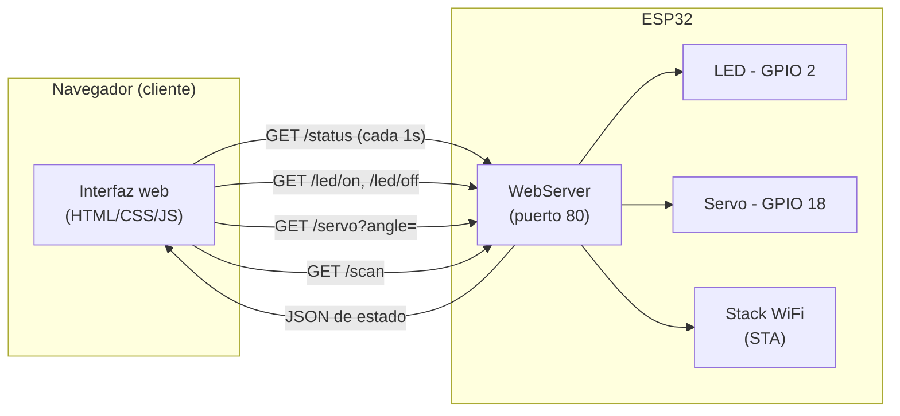

# Panel de Control ESP32 (LED y Servo vía WiFi)

## 1. Objetivos y Alcance

Implementar un sistema embebido basado en ESP32 que exponga una **interfaz web local** para:
- Monitorear en tiempo real el estado de la conexión WiFi y del hardware del microcontrolador.
- Controlar actuadores conectados al ESP32 (un LED y un servomotor) desde el navegador, sin necesidad de una app externa.

El alcance se limita a la red local: el ESP32 actúa como cliente WiFi y como servidor HTTP, sirviendo tanto la interfaz (HTML/CSS/JS) como los datos (JSON) desde el mismo firmware.

## 2. Arquitectura y Componentes

| Componente | Rol |
|---|---|
| ESP32 | Microcontrolador con WiFi integrado, corre el firmware y el servidor web |
| LED (GPIO 2) | Actuador digital on/off |
| Servomotor (GPIO 18) | Actuador PWM, controlado con la librería `ESP32Servo` |
| `WebServer` (Arduino core) | Servidor HTTP embebido en el ESP32, puerto 80 |
| Navegador (cliente) | Renderiza la interfaz y hace polling de datos vía `fetch` |

## 3. Diagrama de Bloques / Flujo

## 4. Desarrollo e Implementación (Código/Configuración)

Código fuente: [`sketch_aug29a/sketch_aug29a.ino`](sketch_aug29a/sketch_aug29a.ino)

- **`setup()`**: inicializa el puerto serie, configura el pin del LED, adjunta el servo (`myServo.attach(servoPin, 500, 2400)`), conecta el ESP32 a la red WiFi configurada y registra los endpoints del servidor.
- **Endpoints registrados con `server.on(...)`**:
  - `/` → sirve la interfaz web (HTML embebido en `PROGMEM`).
  - `/status` → arma un JSON con el estado de WiFi (SSID, RSSI, IP, gateway, etc.), estado del LED, ángulo del servo y telemetría del chip (heap libre, temperatura, frecuencia, uptime, MAC, flash, motivo de reinicio).
  - `/scan` → dispara `WiFi.scanNetworks()` y devuelve las redes cercanas en JSON.
  - `/led/on` y `/led/off` → cambian el estado del LED con `digitalWrite`.
  - `/servo?angle=` → lee el parámetro `angle` y mueve el servo con `setServoAngle()`.
- **`loop()`**: se limita a `server.handleClient()`, ya que toda la lógica es manejada por los callbacks de cada endpoint.

## 5. Pruebas y Evidencias de Funcionamiento

> Pendiente: agregar captura/foto del panel funcionando contra el ESP32 real (ver sección 2.2).

---

# 2. MÓDULO 2: INTERFAZ WEB E IOT CON ESP32

## 2.1 Especificación del Sistema Embebido

- **Plataforma Hardware / Entorno de Simulación:** ESP32 físico.
- **Protocolos / Comunicación:** HTTP REST (polling desde el cliente vía `fetch`, sin WebSockets ni MQTT).
- **Sensores / Actuadores Conectados:**
  - LED en GPIO 2 (actuador digital).
  - Servomotor en GPIO 18, controlado por PWM vía `ESP32Servo` (actuador analógico/posicional, 0°–180°).
  - No hay sensores externos: los datos mostrados (RSSI, temperatura interna, heap, uptime, etc.) provienen de la propia telemetría del chip ESP32 y del stack WiFi.

## 2.2 Arquitectura del Servidor y Frontend

**Estructura del código (backend en el microcontrolador):**
El firmware usa la librería `WebServer` de forma síncrona: cada ruta se asocia a una función handler mediante `server.on("/ruta", handler)`, y `server.handleClient()` en `loop()` procesa una petición por vez. No se usan eventos WebSocket ni tareas asíncronas; el estado (ángulo del servo, estado del LED) se mantiene en variables globales (`servoAngle`, lectura directa de `digitalRead(ledPin)`) que cada handler lee o modifica al ser invocado.

**Frontend:**
La interfaz ([`sketch_aug29a/interfaz.html`](sketch_aug29a/interfaz.html), embebida también en el `.ino` como constante `PAGE_HTML`) hace polling a `/status` cada 1000 ms con `fetch` + `setInterval` para refrescar la UI en tiempo real (RSSI, estado del LED, ángulo del servo, telemetría del chip). Las acciones del usuario (toggle del LED, slider del servo, botón de escaneo de redes) disparan peticiones `fetch` directas a los endpoints correspondientes, sin recargar la página.

**Captura de la Interfaz Web:**

> Pendiente: insertar pantallazo de la UI mostrando lectura de datos en tiempo real y control de actuadores (LED / servo).
